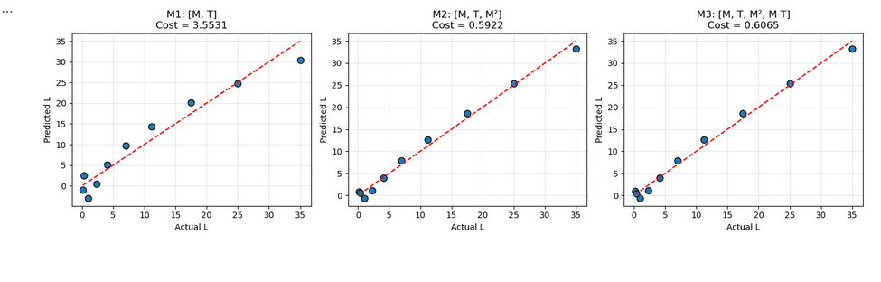

# Stellar Luminosity - Linear and Polynomial Regression

Machine Learning Bootcamp - Digital Transformation and Enterprise Architecture  
Samuel Leonardo Albarracin Vergara

## Overview

This project implements linear and polynomial regression from scratch (no ML libraries) to model stellar luminosity based on mass and temperature. The goal is to understand the fundamentals of gradient descent and feature engineering.

## Repository Structure

```
/
├── README.md
├── 01_part1_linreg_1feature.ipynb
└── 02_part2_polyreg.ipynb
```

## Notebooks

**Part 1** - Linear regression with one feature (M → L). Includes cost surface visualization, gradient descent implementation (both loop and vectorized versions), and convergence analysis.

**Part 2** - Polynomial regression with multiple features [M, T, M², M·T]. Compares different feature combinations and analyzes the interaction term importance.

## AWS SageMaker Execution Evidence

### How I uploaded the notebooks

I uploaded the notebooks by dragging them directly from my local machine into the SageMaker Studio file browser. I dropped them in the `userdefaultefs` folder and opened them from there.

### Screenshots

**Both notebooks in SageMaker Studio:**


**Successful execution - Part 1 (convergence plot):**


**Successful execution - Part 2 (predicted vs actual):**



**Cost surface 3D plot rendered in SageMaker:**


### Local vs SageMaker execution

I ran both notebooks locally and on SageMaker Studio. A few things I noticed:

- **Speed:** SageMaker ran slightly faster, probably because of the cloud instance resources. The difference wasn't huge since the dataset is small, but gradient descent iterations completed quicker.

- **Environment:** Locally I had to make sure numpy and matplotlib were installed. In SageMaker, the default kernel already had everything ready, so no extra setup was needed.

- **Output:** The plots and numerical results were identical in both environments. No differences in the final parameters or cost values.

Overall, SageMaker made execution straightforward since everything was pre-configured.
